# An automated soccer robot for RoboCup Junior Soccer Open

## Introduction
RoboCup Junior(RCJ) is a one of the largest and most recognized robotics competition. Over the years, RCJ has expanded globally, attracting teams from numerous countries and providing a platform for teenagers to engage with technology in a meaningful way. The competition emphasizes creativity and problem-solving, aligning with educational theories that advocate active, hands-on learning experiences for students of diverse abilities and interests. \
Website: https://junior.robocup.org/ 

RoboCup Junior Soccer Open is a subleage of RCJ. The team of young engineers design, build, and program two fully
autonomous mobile robots to compete against another team in matches. The robots must detect a ball
and score into a color-coded goal on a special field that resembles a human soccer field. The competition is played with a passive, brightly colored orange ball. The robots may weight up to 2.2KG, and have a ball-capturing zone of 1.5CM.\
Rules: https://robocup-junior.github.io/soccer-rules/2025-soccer-draft-rules/rules.pdf

## Track Record

### 2022
- RoboCup China Open - 1st Runner-up

### 2021
- RoboCup Junior Asia-Pacific - Champion
- RoboCup Junior Worldwide - SuperTeam Champion
- RoboCup Junior Soccer Sim Asia-Pacific - Champion

### 2020
- RoboCup Junior Asia-Pacific - 2nd Runner-up

### 2019
- Hong Kong Robotic Soccer Tournament - Champion
- RoboCup Junior Japan Open
- RoboCup China Open - 3rd Runner-up
- RoboCup Taiwan Open - 1st Runner-up

### 2018
- Hong Kong Robotic Soccer Tournament - Champion
- RoboCup China Open

## 2017
- RoboCup Junior Hong Kong Open - 2nd Runner-up

## Hardware Development
The main focus of the project is how to locate the orange ball. An omni-directional camera system featuring a camera module and a hyperbola mirror was designed.

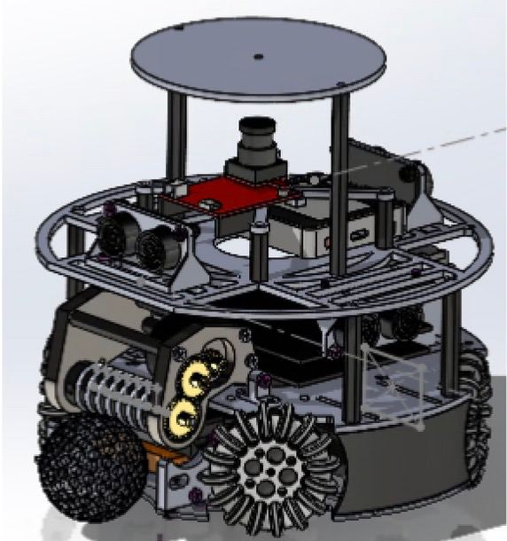
The robot was designed on Solidworks. It is made up of carbon fibre and some 3D printing components.

CAD of each layer:
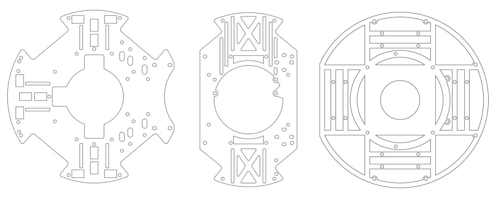

- Bottom layer
    - Whell base
    - Grayscale sensors for white-line boundary detection
    - Kicker syste,
    - Battery storage
- Middle layer
    - Motor drivers
    - Dribbler 
    - Main shield and mirco-controller
- Upper layer
    - Distance sensor (Ultrasonic / ToF sensor)
    - Display screen
    - Gyro sensor
    - Camera module and Hypabola mirror
    - Buttons

### 1. Wheel base
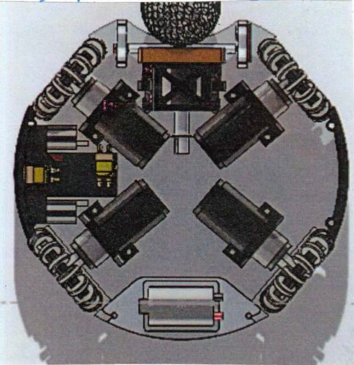
An wheel base of 4 omni-wheel with staller motor was developed to let the robot move in all directions.

- Omni Wheel
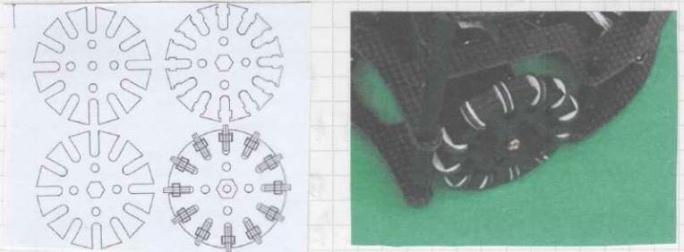
We developed our own omni-wheel, which compose of 3 layer of carbon fibre board and small aluminium wheels crafted from CNC macine

- Kicker System
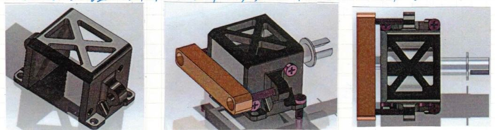
Instead of solely pushing the ball to goal, we hope to imitate the kicking process of football players. We used electric solenoid to act as a shooter. When the ball is in front of us, we "kick" the ball.

### 2. Dribbler
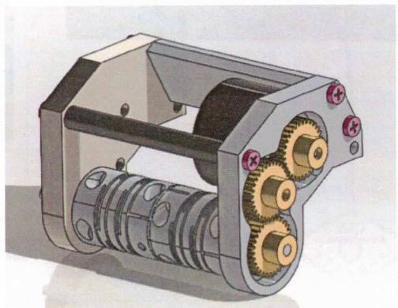
One of our WoW factor. One general problem in soccer robot is that it is difficult for the robot "capture" the ball. When pushing the ball forward, it may slip away. We want to imitate the dribbling action of football player, so that we can have a better strategic playing, for example, dribbling the ball and turn around to hide it from the opponents.

It consist of a brushless motor as source of motion, a 1:2:2 gear set, and a rod covered with silicon to create enough friction to hold the ball.

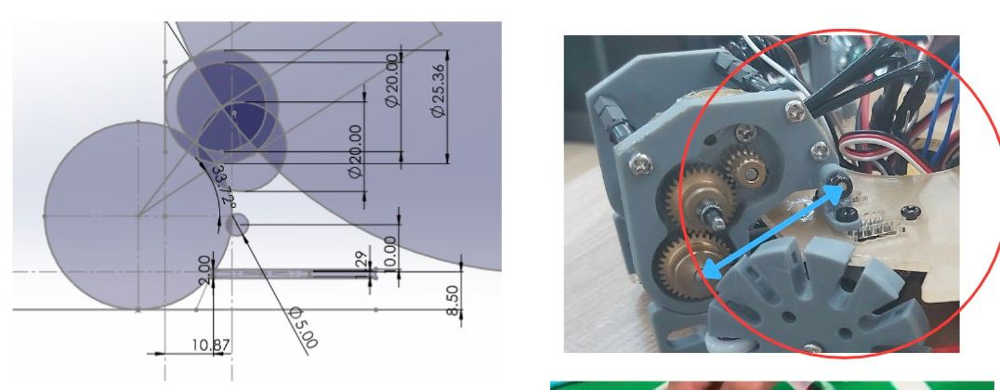

Testing video showing the dribbler and kicker: https://drive.google.com/file/d/1Q9YFrj2bjihNOQVifX7z66hPqvV7yJWf/view?usp=sharing 

### 3. Hyperbola Mirror
In order to locate the organe ball on the field, we developed a computer vision system that consist of a camera module and a cone mirror as shown in this figure.
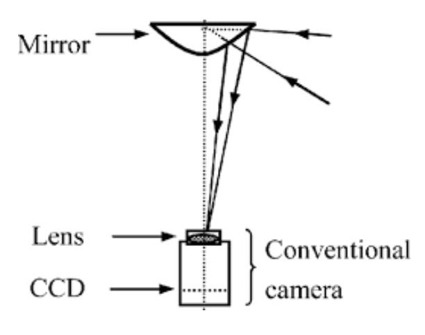
As such, the camera can have a 360 view of the whole soccer field, and with mathematical calculation, we can locate the organe ball easily.
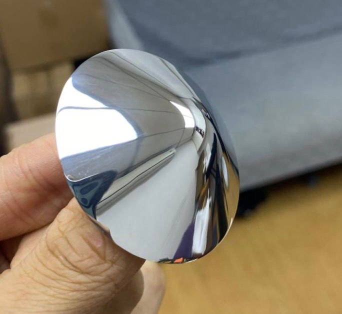
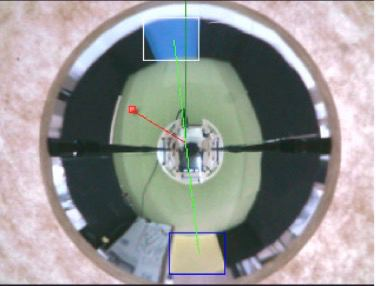

### 4. PCB Developemet
We developed our own PCB board for motor drivers, main shield on Teensy micro-controller, solenoid circuit board, and Gyro sensor.

## Software Development
### 1. Computer Vision for ball tracking
We used CNN to identify the orange ball, yellow and blue goal from the soccer field. The training set consist of 1000 images of the orange ball, the model accuracy acheived ~98.7%
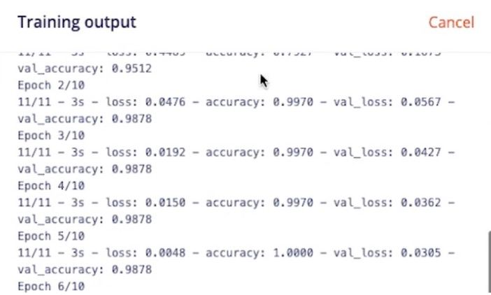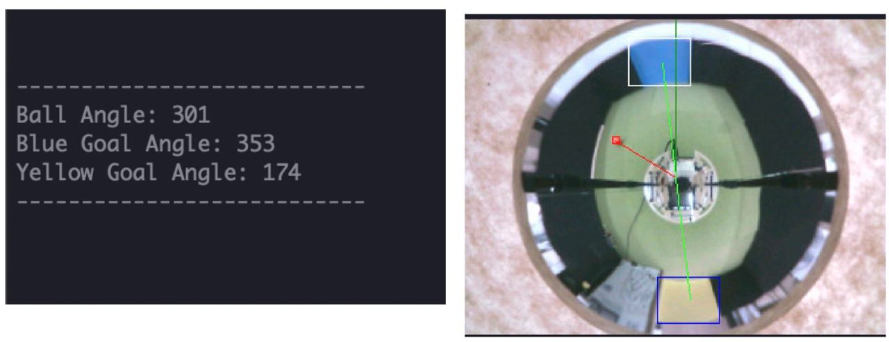

### 2. UI Interface
We used M5Stack as the display screen. I designed the UI interface using Figma
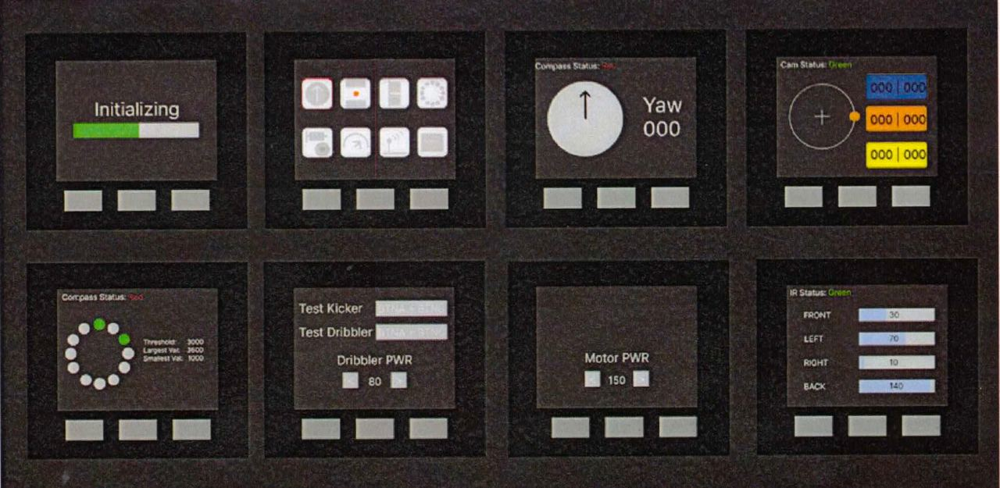

### 3. Motor Kinematics

## Result
Click here for demo videos: https://drive.google.com/drive/folders/1UQwbd5lmgAEMQEA6z1JV2sSAjwiwAVFd?usp=sharing 

